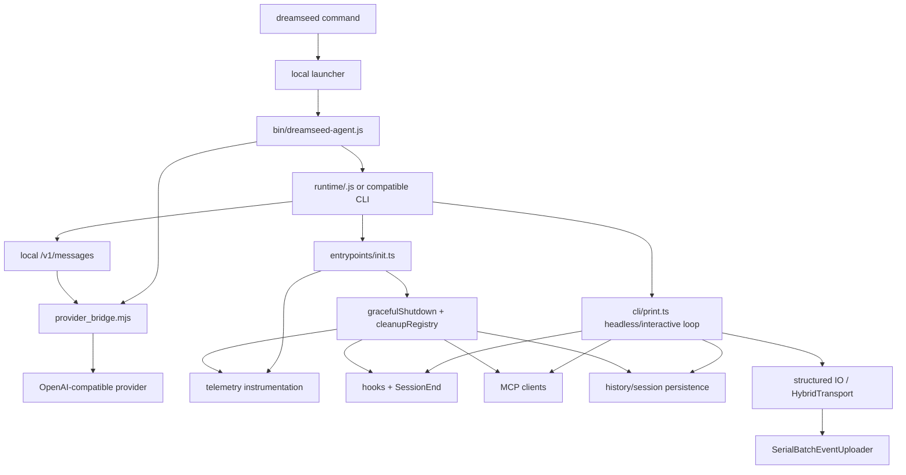
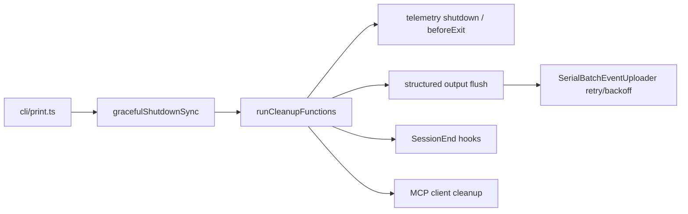

# DreamSeed Kernel Knowledge Graph

This document records the single-runtime route used by DreamSeed after removing
the experimental fast/lite kernel. DreamSeed now keeps one compatible runtime
and wraps it with provider, memory, MCP, history, audit, and packaging layers.

## Runtime Graph



## Compatible Runtime Risk Chain

The compatible runtime is powerful, but its startup and shutdown path is broad:

- `entrypoints/init.ts` installs graceful shutdown, telemetry, LSP cleanup, and
  session-team cleanup.
- `cli/print.ts` registers extra cleanup for headless `--print`, drains memory
  extraction, handles background tasks, flushes structured output, and then calls
  graceful shutdown.
- `gracefulShutdown.ts` runs registered cleanup functions, SessionEnd hooks,
  startup profiling, cache eviction analytics, telemetry, and finally exits.
- `utils/telemetry/instrumentation.ts` registers `beforeExit` and cleanup
  flush/shutdown handlers for OpenTelemetry providers.
- `cli/transports/HybridTransport.ts` and `SerialBatchEventUploader.ts` can wait
  for serialized event flushes and retry failed POSTs with backoff.

This means fixed 79-82 second delays should be treated as compatible-runtime
lifecycle issues, not as provider bridge, MCP config, hook config, or legacy
history issues unless those layers fail their own doctors.



## Operational Rule

Use one compatible runtime:

```powershell
$env:DREAMSEED_COMPAT_KERNEL_JS = "D:\\DreamSeed-Local-Agent\\runtime\\compatible-kernel.js"
dreamseed --print "hello"
dreamseed
```

`dreamseed compat ...` remains a hidden compatibility alias for older local
commands, but published documentation should teach `dreamseed ...` directly.
